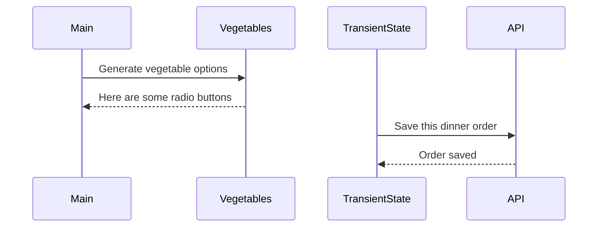

# Events and State Self-Assessment

> 🧨 Make sure you answer the vocabulary and understanding questions at the end of this document before notifying your coaches that you are done with the project

## Setup

1. Make sure you are in your `workspace` directory
1. `git clone {github repo SSH string}`
1. `cd` into the directory it creates
1. `code .` to open the project code
1. Use the `serve` command to start the web server
1. Open the URL provided in Chrome

## Requirements

### Initial Render

1. All 10 base dishes should be displayed as radio input options.
1. All 9 vegetables should be displayed as radio input options.
1. All 6 side dishes should be displayed as radio input options.
1. All previously purchases meals should be displayed below the meal options. Each purchase should display the primary key and the total cost of the purcahsed meal.

### State Management

1. When the user selects an item in any of the three columns, the choice should be stored as transient state.
1. When a user makes a choice for all three kinds of food, and then clicks the "Purchase Combo" button, a new sales object should be...
    1. Stored as permanent state in your local API.
    1. Represented as HTML below the **Monthly Sales** header in the following format **_exactly_**. Your output will not have zeroes, but the actual amount.
        ```html
        Receipt #1 = $00.00
        ```
   1. The user's choices should be cleared from transient state once the purchase is made.

## Design

Given the description and animation above...

1. Create an ERD for this application before you begin.
1. Make a list of what modules need to be created to make your application as modular as possible. Create a **Dependency Graph** for the project to be reviewed once you are complete with the assessment.
https://lucid.app/lucidspark/4abc6b86-f09f-43ba-8784-95a0894a0736/edit?viewport_loc=-1380%2C-631%2C2293%2C1701%2C0_0&invitationId=inv_852395f7-ad50-4004-a0d4-b014319d6a51
1. Create a **Sequence Diagram** that visualizes what your algorithm is for this project. We'll give you a minimal starting point.



## Vocabulary and Understanding

> 🧨 Before you click the "Assessment Complete" button on the Learning Platform, add your answers below for each question and make a commit. It is your option to request a face-to-face meeting with a coach for a vocabulary review.

1. Should transient state be represented in a database diagram? Why, or why not?
   > Yes, because the transientstate module invokes the placeOrder function that sends what we have stored in transientstate to the empty purchases array to show every monthly order that has been processed. This is an important function whithin the code and is handled by the transient state module. 
2. In the **FoodTruck** module, you are **await**ing the invocataion of all of the component functions _(e.g. sales, veggie options, etc.)_. Why must you use the `await` keyword there? Explain what happens if you remove it.
   > The Sides, Entrees, and Veggies functions are all fetching data from a JSON server database, making them asynchronous functions. Fetching data from a jason database takes time to retrieve. The await keyword allows for the rest of the code to run while the data is being retrieved. Without these keywords, the code would try to use this data before it arrives, thus breaking the code. When setting these functions equal to a new varibale the await keywords are used. 
3. When the user is making choices by selecting radio buttons, explain how that data is retained so that the **Purchase Combo** button works correctly.
   > Every selection chosen from the radio buttons is held in a transientState object with properties noted down for every selection made. The placeOrder function uses a POST method which sends all our selected orders to an array in our database called 'purchases'. This placeOrder function is invoked whenever our placeOrderButton is clicked. The handlePlaceOrderClick function invokes our placeOrder function if the purchase combo button is clicked, thus storing our transient state data in the purchases array in our database. 
4. You used the `map()` array method in the self assessment _(at least, you should have since it is a learning objective)_. Explain why that function is helpful as a replacement for a `for..of` loop.
   > The .map() method uses less room than a traditional for... of loop. Additionally the .map() method bypasses the need to push our iterated array to an empty array. The map method already makes an array for us without changing the original data from the database. We can also chain other methods such as filter and find with our .map method, which in turn creates cleaner syntax and uses fewer lines of code. 
